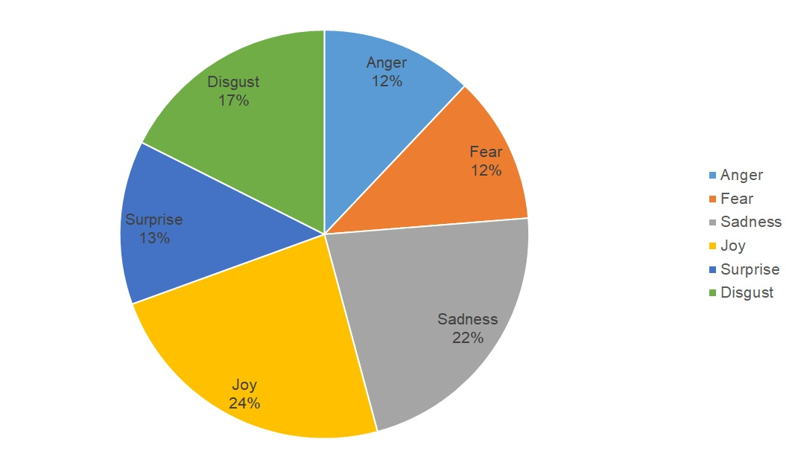

# ELTEA17
Entity-Level Tweets Emotion Analysis Dataset


Distribution of annotated data in sentence-level, over Ekman classes



## Annotation
This dataset has both sentence-level and token-level annotation. In the sentence-level annotation, each sentence is annotated with one of the six Ekman's classes. In the token-level an- notation, the annotation indicates each lexicon for their role (i.e., emotion holder, cause and target), plus emotion keywords.
```json
    {
        "emotion": "fea",
        "text": "I need a chemistry tutor because this is blowing me",
        "sarcasm": "N",
        "sent_num": "305"
    },
```

Tokens/Tags|I|need|a|tutor|because|**chemistry**|**exam**|is|**killing**|**me**
-----------|-----------|-----------|-----------|-----------|-----------|-----------|-----------|-----------|-----------|-----------
Anger|O-AN|O-AN|O-AN|O-AN|O-AN|O-AN|O-AN|O-AN|O-AN|O-AN
Disgust|O-DI|O-DI|O-DI|O-DI|O-DI|O-DI|O-DI|O-DI|O-DI|O-DI
Fear|O-FE|O-FE|O-FE|O-FE|O-FE|O-FE|O-FE|O-FE|**B-FE**|O-FE
Sadness|O-SA|O-SA|O-SA|O-SA|O-SA|O-SA|O-SA|O-SA|**B-SA**|O-SA
Surprise|O-SU|O-SU|O-SU|O-SU|O-SU|O-SU|O-SU|O-SU|O-SU|O-SU
Joy|O-JO|O-JO|O-JO|O-JO|O-JO|O-JO|O-JO|O-JO|O-JO|O-JO
Holder|O-EH|O-EH|O-EH|O-EH|O-EH|O-EH|O-EH|O-EH|O-EH|**B-EH**
Cause|O-EC|O-EC|O-EC|O-EC|O-EC|**B-EC**|**I-EC**|O-EC|O-EC|O-EC
Target|O-ET|O-ET|O-ET|O-ET|O-ET|O-ET|**B-ET**|O-ET|O-ET|O-ET


Total number of tweets||2034
-----------|-----------|-----------
Cross validation: 5-fold|Total number of tweets in train segment|1627
Cross validation: 5-fold|Total number of tweets in test segment|407 
Maximum tweet length||38  
Minimum tweet length||3   
Average tweet length||24  
Vocabulary size||4330


Emotion|# tweets|# tweets with cause (%)|# tweets with target (%)|# tweets with holder (%)
-----------|-----------|-----------|-----------|-----------
Joy|488|226 (46.3 \%)|433 (88.72 %)|451 (92.41 %)
Anger|246|101 (41.22 \%)|164 (66.66 %)|172 (69.91 %)
Disgust|345|112 (32.46 \%)|298 (86.37 %)|283 (82.02 %)
Fear|244|98 (40.15 \%)|151 (61.88 %)|186 (76.22 %)
Sadness|447|207 (46.25 \%)|421 (94.18 %)|428 (95.74 %)
Surprise|264|117 (44.46 \%)|194 (73.48 %)|188 (71.21 %)
Total| 2034|861 (42.33 \%)|1661 (81.66 %)|1708 (83.97 %)

Emotion|Maximum length|Minimum length|Average length
-----------|-----------|-----------|-----------
Joy|33|2|19
Anger|33|4|21
Disgust|38|7|23
Fear|30|4|19
Sadness|38|3|20
Surprise|32|5|19


## Citation
For academic usage please cite the following pre-print
[Structured Emotion Prediction of Tweets With Co-extraction of Cause, Holder and Target of Emotions](https://www.researchgate.net/profile/Roozbeh-Bandpey-2/publication/341344305_Structured_Emotion_Prediction_of_Tweets_With_Co-extraction_of_Cause_Holder_and_Target_of_Emotions/links/5ebbc08ea6fdcc90d6728396/Structured-Emotion-Prediction-of-Tweets-With-Co-extraction-of-Cause-Holder-and-Target-of-Emotions.pdf)

Bib format
```bib
@PrePrint{Bandpey,
  author    = {Roozbeh Bandpey},
  title     = {Structured Emotion Prediction of Tweets With Co-extraction of Cause, Holder and Target of Emotions},
  booktitle = {Structured Emotion Prediction of Tweets With Co-extraction of Cause, Holder and Target of Emotions. pages 15-25. ResearchGate},
  year      = {2017}
}
```